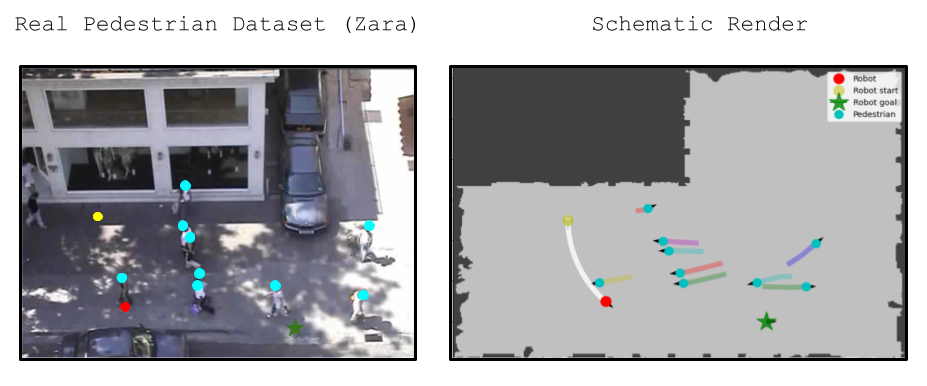

# SocNavBench
Welcome to the Social Navigation Benchmark utility (SocNavBench), a codebase for benchmarking robot planning algorithms against various episodes of containing multi-agent environments, accompanying out paper ["SocNavBench: A Grounded Simulation Testing Framework for Evaluating Social Navigation"](http://www.cs.cmu.edu/~abhijatb/assets/THRI_SocNav_Benchmark.pdf).


We provide scenarios curated from real world data for social navigation algorithms to be tested and evaluated on.



We also provide multiple curated maps that closely resemble the environments for the pedestrian datasets. 


## How To's
### Install
Guide for installation at [`docs/install.md`](docs/install.md)

### Use
Guide for usage at [`docs/usage.md`](docs/usage.md)

## Acknowledgements
This work was funded under grants from the National Science Foundation (NSF IIS-1734361) and the National Institute on Disability, Independent Living, and Rehabilitation Research (NIDILRR 90DPGE0003).

This project is also built upon the *Human Active Navigation* ([HumANav](https://github.com/vtolani95/HumANav-Release)) and *Learning-Based Waypoint Navigation* ([Visual-Navigation](https://github.com/smlbansal/Visual-Navigation-Release)) codebases. Special thanks to [Varun Tolani](https://github.com/vtolani95) for helping us with his projects.

## Citation
If you use our work, please cite the corresponding work:
```
@article{biswas2021socnavbench,
  title={SocNavBench: A Grounded Simulation Testing Framework for Evaluating Social Navigation},
  author={Biswas, Abhijat and Wang, Allan and Silvera, Gustavo and Steinfeld, Aaron and Admoni, Henny},
  journal={arXiv preprint arXiv:2103.00047},
  year={2021}
}
```
