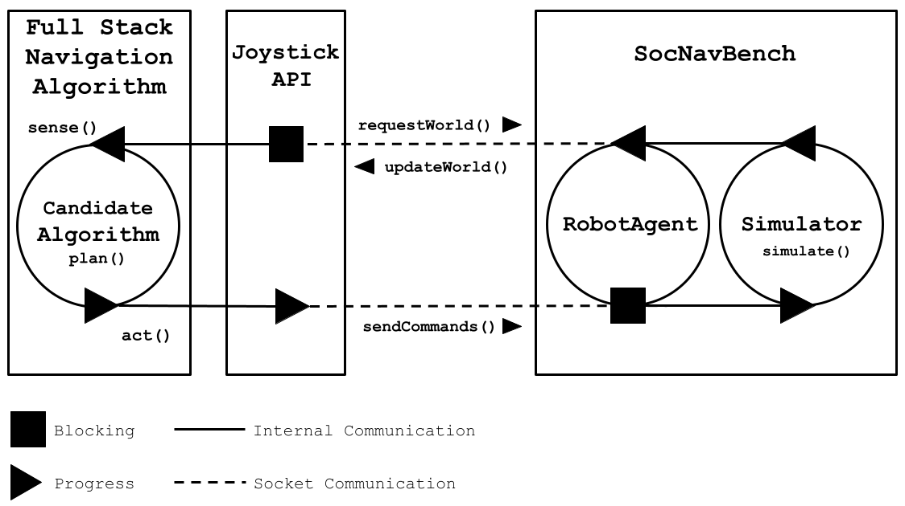
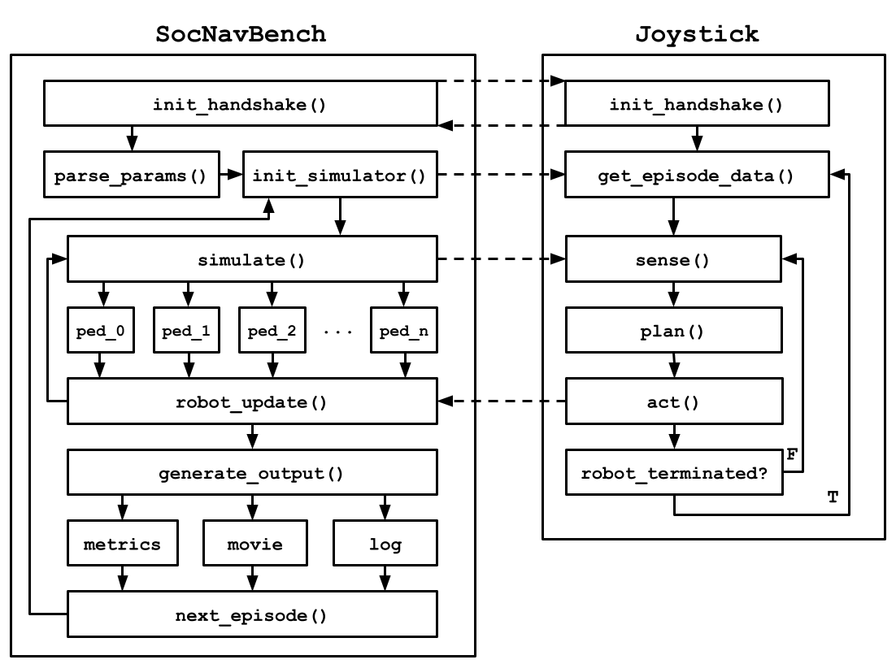
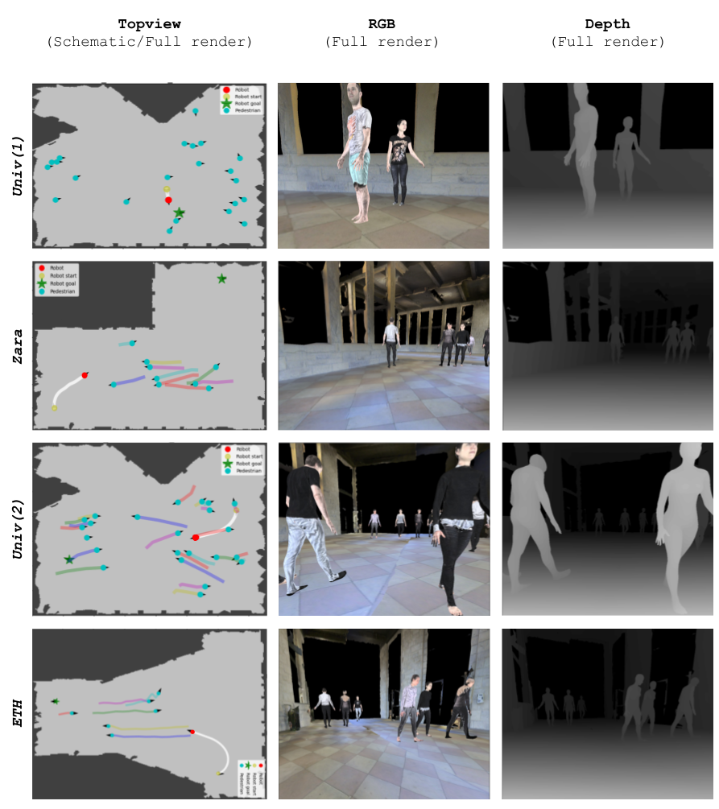

# Usage and Information
## Overall Structure of the Simulator
The simulator used in `SocNavBench` runs through a single episode to execute and measure a robot's planning algorithm for a particular episode. An episode consists of parameters such as the pedestrians, environment, and robot's start/goal positions. In order to measure arbitrary planning algorithms we provide a `Joystick API` that encodes data to and from the simulator to control the robot. 

All our agents undergo a `sense()->plan()->act()` cycle to perceive and interact with the world. 

The simulator can be run in synchronous and asynchronous modes. In synchronous-mode the joystick will block on the arrival of data from its `sense()` call, and the `RobotAgent` will equivalently block on the actions/commands sent from the joystick, making their communication transaction 1:1 with the simulator time. In asynchronous-mode the simulator will run in real time and the joystick's planning algorithm will have to keep up. 

## Top Level Overview

## More Detailed Overview


## Running `SocNavBench`
To start SocNavBench run the first command below (1) to see `Waiting for joystick connection...` Then run the second command (2) as a separate executable (ie. in another shell instance) to start the `Joystick` process.
```bash
# The command to start the simulator (1)
# Note the PYOPENGL_PLATFORM=egl is only necessary if you're using the full-render (non-schematic) mode
PYOPENGL_PLATFORM=egl PYTHONPATH='.' python3 tests/test_episodes.py

# The command to start the joystick executable (in another process) (2)
PYTHONPATH='.' python3 joystick/joystick_client.py

# now the two executables will complete the connection handshake and run side-by-side
```
Note that the first time SocNavBench is run on a specific map it will generate a `traversible` (bitmap of unobstructed areas in the map) that will be used for the simulation's environment. This traversible is then serialized under `SocNavBenchmark/sd3dis/stanford_building_parser_dataset/traversibles/` so it does not get regenerated upon repeated runs on the same map.

### Note on using custom maps
If you are interested in taking some kind of 2D representation of a map/environment (such as a top-down image/bitmap) and use that in the SocNavBench simulator, read on.

The current simulator expects an input environment from one of the curated [sd3dis](http://buildingparser.stanford.edu/dataset.html) environments (Univ, Zara, Hotel, ETH, DoubleHotel) that we have made. You can view the logic for reloading maps [here](https://github.com/CMU-TBD/SocNavBench/blob/476bd383d57bc44719f8fb92ff6b12144ab072c8/sbpd/sbpd.py#L51-L62) which looks for all `.obj` files that match the name of a building. To introduce a new custom building to the simulator, you would need to convert your 2D representation into a "3D" `.obj` file by duplicating the ground vertices/faces up to some reasonable (>0) height so the 3D map has essentially binary depth. This should be very doable since `.obj` files are human readable text files describing a 3D mesh. Once you have a functional `.obj` file (viewable in blender for example) you will need to place it in the building mesh directory `SocNavBench/sd3dis/stanford_building_parser_dataset/mesh/` following the other maps (in a directory `custom_map_name/custom_map.obj`) and then your config file should specifically request the `"custom_map"` as the map for your episode. 

## The `Joystick` API
In order to communicate with the robot's sense-plan-act cycle from a process external to the simulator we provide this "Joystick" interface. In synchronous mode the `RobotAgent` (and by extension `Simulator`) blocks on the socket-based data transmission between the joystick and the robot, providing "free thinking time" as the simulator time stops until the robot progresses. 

The `Joystick` is guaranteed to complete several key functions:
- `init_send_conn()` which establishes the socket that sends data to the robot.
- `init_recv_conn()` which establishes the socket that receives data from the robot.
- `get_all_episode_names()` which gets all the episodes (by name) that will be executed.
- `get_episode_metadata()` which gets the specific metadata (see `Episodes` below) for the incoming episode.

These functions are provided in `python3` and `c++` in [`joystick/joystick_client.py`](../joystick/joystick_client.py) and [`joystick/joystick_client.cpp`](../joystick/joystick_client.cpp) respectively.

Users will be responsible for implementing their own:
- `sense()` which requests a JSON-serialized [`sim_state`](../simulators/sim_state.py) and parses it.
- `plan()` which uses the new information from the sense to determine next actions to take.
- `act()` which sends commands to the robot to execute in the simulator.

For communications we use the `AF_UNIX` protocol for the fastest communications within a local host machine. The default socket identifiers are `/tmp/socnavbench_joystick_recv` and `/tmp/socnavbench_joystick_send` which may be modified in [`params/user_params.ini`](../params/user_params.ini) under `[robot_params]`. 
  
### A starting off point
For joystick implementations we have provided two sample joystick instances in `python` and one in `c++` under [`SocNavBench/joystick/`](../joystick/):
- [`joystick_random.py`](../joystick/joystick_py/joystick_random.py) which uses a generic random planner, showcasing one of the simplest uses of the Joystick interface.
- [`joystick_planner.py`](../joystick/joystick_py/joystick_planner.py) which uses a basic sampling planner that can take the robot to the goal without obstacle collisions (pedestrian unaware).
- [`joystick_client.cpp`](../joystick/joystick_cpp/joystick_client.cpp) which is a simple random planner as well, but in `c++`. Highlighting the language-agnostic nature of the API.
  - Note: To build our cpp client run 
    ```bash
    g++ -g joystick/joystick_client.cpp
    ```
    NOTE: if you get an error for `#include "joystick_cpp/json.hpp` then you'll need to download [this json c++ file](https://github.com/nlohmann/json/blob/develop/single_include/nlohmann/json.hpp) and place it in `joystick_cpp/`. We used this json implementation since it was simplest and self-contained. We'll probably make a `makefile` in an upcoming task.
  
To run the joystick client with a particular algorithm you can make use of the `--algo` flag. Note that we have more algorithms supported in this [joystick-only repository](https://github.com/CMU-TBD/SocNavBench-baselines). There are instructions there on how to integrate those joysticks with the existing SocNavBench. 
```bash
# the following showcases all the algorithms we have tested support for
# to see more on using all these algorithms, visit our joystick-specific repository here
# https://github.com/CMU-TBD/SocNavBench-baselines
PYTHONPATH='.' python3 joystick/joystick_client.py --algo "Sampling"
PYTHONPATH='.' python3 joystick/joystick_client.py --algo "Random"
PYTHONPATH='.' python3 joystick/joystick_client.py --algo "RVO"
PYTHONPATH='.' python3 joystick/joystick_client.py --algo "RVOwCkpt"
PYTHONPATH='.' python3 joystick/joystick_client.py --algo "Sacadrl"
PYTHONPATH='.' python3 joystick/joystick_client.py --algo "SacadrlwCkpt"
PYTHONPATH='.' python3 joystick/joystick_client.py --algo "social-force"
```

Also note that joystick must be run in an external process (but within the same `conda env`). Make sure before running `joystick_client.py` that the conda environment is `socnavbench` (same as for `test_socnav.py` and `test_episodes.py`)

## Multi-robot mode
An often useful feature is to compare different robot ("joystick") algorithms side-by-side in the same scenario. This can be done with SocNavBench after a bit of labour. 
1. We'll need to run all the desired algorithms on the episode
2. We'll need to store all the historical data for those previous runs (default behaviour per runs)
3. We'll finally need to render a scene using all the historical data combined

For a large number of algorithms, this is a very tedious process. To help, we have provided a script ([`run_multi_robot.sh`](../run_multi_robot.sh)) that will automate this process. 
- Note that most algorithm implementations have different procedures to run (such as calling an auxiliary process for the planning API).
  - We have included all the necessary steps for the algorithms in [`SocNavBench-baselines`](https://github.com/CMU-TBD/SocNavBench-baselines) in the script, but you will need to add your own for custom algorithms. 

Running the multi-robot script:
```bash
# cd to SocNavBench/ (within the socnavbench conda environment)
./run_multi_robot.sh
```
- **Note** In order to change which episodes are being run on, you can edit the `tests` list in [`episode_params_val.ini`](../params/episode_params_val.ini). For now we only support this script with a single test at a time, you'll need to edit the param file again to run all the algorithms on another test. 

You should then see output such as:
```python
...
Started simulator server for algo "RVO" (pid: 345864)...
Started joystick client for algo "RVO" (pid: 345884)...
Started "./joystick/RVO2/RVO2" executable (pid: 345897)...
Joystick "RVO" completed
Stopped "./joystick/RVO2/RVO2" executable
Finished process for algo "RVO"
...
```
- The script should handle cleaning up all child processes. All logs are redirected to `tests/socnav/run_multi_robot_logs/` organized by algorithm name (Includes one `.log` file for the simulator, joystick, and any auxiliary processes). 
  - Additionally, the simulator will automatically export the simulator frame data for every frame into `sim_state_data/` as a `.json` file ordered by the simulator time. This makes it easy to deserialize all the world information at a particular time for a particular algorithm on a particular episode. 

**Note** that it is often useful to run without rendering a movie per episode. This can be done by setting the `render_movie` param to `False` in [`user_params.ini`](../params/user_params.ini) under `[renderer_params]`.
- Just make sure to set it back to `True` when calling `test_multi_render.py` else you'll get no movie!

Here's an example of `t_eth_dense_against` rendered with all robots side-by-side


## Robot
As depicted in the [`user_params.ini`](../params/user_params.ini) user params file, the default robot is modeled after a [Pioneer P3DX robot](https://www.generationrobots.com/media/Pioneer3DX-P3DX-RevA.pdf). Since the simulation primaily focuses on the base cross-section of the robot, those are the dimensions we use. 

Also note that we are making the assumption that both the system dynamics of the robot and the environment are the same. More information about the system dynamics can be found in the [`SocNavBench/systems`](../systems/) directory for the Dubins Car models we use. 

Additionally, we provide the option to not use system dynamics at all and instead have the robot *teleport* to a position within the feasible velocity range. This can be toggled from the `use_system_dynamics` flag under `[joystick_params]` in [`user_params.ini`](../params/user_params.ini). This requires a slight modification in the `Joystick` API which will now be expecting a tuple of `(x, y, theta, v)` (position, heading, and velocity) instead of `(v, w)` (linear and angular velocity) commands.

Other functionality of the robot includes:
  - Listening for `Joystick` keywords such as `"sense"`, `"ready"`, `"algo: XYZ"`, or `"abandon"` to specify what action to take given the request. 
    - `"sense"` will send a `sim_state` (see below) to the running `Joystick`.
    - `"ready"` notifies the robot that the `"Joystick"` has fully received the episode metadata and is ready to begin the simulation.
    - `"algo: XYZ"` where `XYZ` is the name of an algorithm (such as `"Random", "Sampling"`) to tell the simulator which planning algorithm is being used (optional).
    - `"abandon"` to instantly power off the robot and end its acting.
  - If the message sent to the robot is not a keyword then it is assumed to be one or more commands from the `act()` phase.

## Episodes
Our episodes consists of all the params used to define a typical scene. See [`episode_params_val.ini`](../params/episode_params_val.ini) for examples:
- `map_name` which holds the title of the specific building (in `sd3dis`) to use for this episode 
- `pedestrian_datasets` which holds the names of the datasets to run in this episode (see [`dataset_params.ini`](../params/dataset_params.ini))
- `datasets_start_t` which holds the starting times for the corresponding pedestrian datasets being used.
- `ped_ranges` which holds the range of pedestrians to use for the corresponding pedestrian dataset being used.
- `agents_start/end` which holds the custom start/goal positions of the autonomous agents (using [`SamplingPlanner`](../planners/sampling_planner.py) for navigation)
- `robot_start_goal` which holds the start position and goal position of the robot
  - Note for all our "pos3's" we use (x, y, theta)
- `max_time` which holds the time budget for this episode
- `write_episode_log` which flags the option to write a simulator log at the end of the simulation

To choose which tests to run, edit the `tests` list under `[episode_params]` in [`episode_params_val.ini`](../params/episode_params_val.ini) which holds the names of the tests to run.

## Agents
Pedestrians used in the simulator can be either [autonomous agents](../agents/humans/human.py) or [prerecorded agents](../agents/humans/recorded_human.py). The autonomous agents follow the same [`SamplingPlanner`](../planners/sampling_planner.py) planner to reach their goal. However we also include the option to use [prerecorded agents](../agents/humans/recorded_human.py) which are from an open-source dataset that recorded real human trajectories in various environments. 
- Since the prerecorded agents have a set trajectory as they are spawned, they cannot interact with the environment or change course to avoid obstacles
- We do provide the option under `[agent_params]` in [`user_params.ini`](../params/user_params.ini) to toggle `pause_on_collide` which will pause the pedestrians' motion for `collision_cooldown_amnt` seconds (simulator time) after a collision with the robot. This feature applies to both Auto-agents as well as Prerecorded-agents. 

The pedestrian datasets are also a component of the user-editable params under [`dataset_params.ini`](../params/dataset_params.ini) which define the following params:
- `file_name` which holds the relative file location of the `.csv` file for the dataset.
- `fps` which holds the framerate that the dataset was captured at.
- `spawn_delay_s` which holds the number of seconds that all agents wait after spawning before moving.
- `offset` which holds the translational (x, y, theta) values for shifting the entire dataset.
- `swapxy` which is used to swap the x and y's from the dataset if the formatting does not match ours
- `flipxn` which is used to negate the x positions
- `flipyn` which is used to negate the y positions

## Simulator
The `Simulator` progresses the state of the world in the main `simulate()` loop, which spawns update threads for all the agents in the scene, updates the robot and captures a "snapshot" of the current simulator status in the form of a `sim_state` that is stored for later use.

By default the simulator runs in "synchronous mode", meaning that it will freeze time until the robot (joystick API) responds. In synchronous mode the robot's "thinking time" is free as the simulator blocks until its reception. In asynchronous mode the simulator runs alongside real-world time and does not wait on the robot's input at all. This means the robot could take too long to think and miss the simulator's cue, in this case the robot may repeat the last command sent by the joystick API or do nothing at all. The maximum number of times the robot can repeat commands is set as `max_repeats` under `[robot_params]` in [`params/user_params.ini`](../params/user_params.ini). In order to toggle the simulator's synchronicity mode edit the `synchronous_mode` param in `[simulator_params]` in [`params/user_params.ini`](../params/user_params.ini).


## `sim_states`
Sim-states are what we use to keep track of a snapshot of the simulator from a high level with no information about the past/future. For example, a `sim_state` instance might contain information similar to what a robot would sense using a lidar sensor, that being the environment and the current pos3's (x, y, theta) of the agents (no velocity, acceleration, trajectory, starts/goals, etc.).

Also note that `sim_states` are designed to be easily serializable and deserializable, allowing for simple `JSON` transmissions between the `RobotAgent` and the `Joystick` API. To see more, look at the `to_json` and `from_json` functions in [`sim_state.py`](../simulators/sim_state.py).

In addition to `SimState` classes, we provide an `AgentState` class which holds the useful information for each agent (robots or pedestrians) in a similar fashion.

All rendering of the simulator's schematic-mode is handled in the sim-state's `render()` function which additionally calls all the agent-state `render()` functions. 

Finally, in order to render multiple robot algorithms side-by-side, we made it easy to export all sim-state data into the output directory of each episode. This allows the `test_multi_render` script to easily find historical data of prior simulator instances and include them in a single render. To see more, look at the **Multi-Robot mode** section of this doc. 

## Visualization
The default rendering mode is `schematic` which renders only the topview of the episode. The topdown view only uses matplotlib to render a "bird's-eye-view" perspective without needing the intensive OpenGL Swiftshader renderer. However, to visualize the Depth/RGB modes change the `render_mode` parameter in [`params/user_params.ini`](../params/user_params.ini) to `full-render`. Note that currently the program does not support parallel image rendering when using the 3D renderer, making it very time consuming. The `schematic` rendering can benefit from multiple cores denoted as `num_procs` in [`params/user_params.ini`](../params/user_params.ini) under `[render_params]`. 

## Rendering Modes:
Here are some examples of expected outputs (`schematic` + `full-render`)


### Random episode sampling 
Random episode sampling support is added to the `random_eps` folder -- look at that [README](../random_eps/README.md) for more.